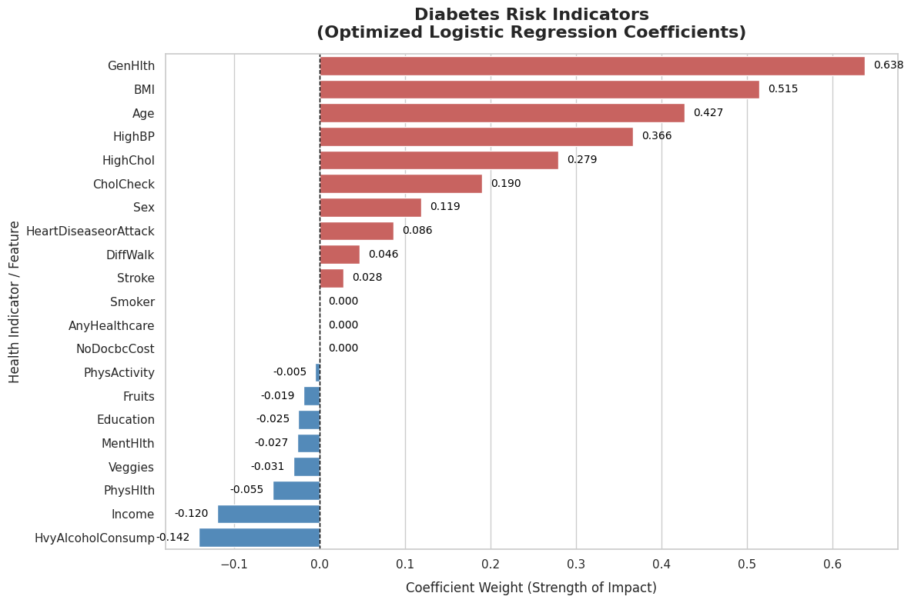
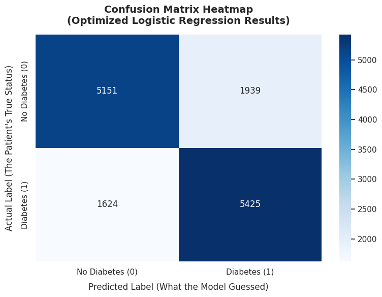

# Diabetes Risk Predictor — Optimized Logistic Regression on BRFSS 2015

[](https://huggingface.co/spaces/saleemshahzad2208/diabetes-predictor)
[](https://github.com/saleemshahzad08/ML-Models-Training-Projects)

---

## Executive Summary

This project trains, optimizes, and deploys a binary classification model to predict whether an individual has diabetes or prediabetes based on a set of 21 health and lifestyle indicators collected from the **Behavioral Risk Factor Surveillance System (BRFSS) 2015** survey — one of the largest health survey datasets in the United States.

The model uses a **Logistic Regression** algorithm wrapped inside a rigorously constructed **scikit-learn Pipeline**, which handles feature normalization and model training as a single, leak-proof workflow. Hyperparameters are tuned automatically using **GridSearchCV** with 3-fold cross-validation across 8 unique parameter combinations, producing a fully optimized production-ready classifier.

The trained model is serialized to disk using `joblib` and served through an interactive **Gradio** web application, hosted on **Hugging Face Spaces** for public access.

---

## Pipeline Architecture

The model is not just a raw classifier — it is a structured **pipeline** of processing steps that execute in a guaranteed order. This section explains each component in plain terms.

### 1. `StandardScaler` — Feature Scaling via Z-Score Normalization

**The Problem:** The 21 input features in this dataset exist on wildly different numeric scales. BMI might range from 10 to 50, while binary yes/no features (like `Smoker` or `Stroke`) only ever take the values 0 or 1. When you feed unscaled data into a Logistic Regression model, features with large numeric ranges exert a disproportionately large influence on the optimization process — not because they are more important, but simply because their numbers are bigger.

**The Solution:** `StandardScaler` transforms every feature so that it has a **mean of 0** and a **standard deviation of 1**. This is called **Z-Score Normalization**.

The transformation formula applied to each value is:

**z = (x - mean) / standard_deviation**

In plain terms: for each feature, the scaler first calculates the average value across all training rows. It then subtracts that average from every value, and divides the result by how spread out the values are. After this transformation, every feature lives on the same standardized scale, giving the Logistic Regression solver a fair and stable optimization landscape.

**Why it matters for this project:** The `saga` solver used here (and regularization penalties like L1/L2) are particularly sensitive to feature scale. Without `StandardScaler`, the coefficients learned by the model would be unreliable and the regularization penalty would apply unevenly across features.

---

### 2. `make_pipeline` — Workflow Encapsulation and Prevention of Data Leakage

**The Problem:** A common and dangerous mistake in machine learning is **data leakage** — accidentally allowing information from your test set to influence your training process. For example, if you fit your `StandardScaler` on the *entire* dataset before splitting into train/test sets, the scaler has already "seen" the test data when computing its mean and standard deviation. This makes your evaluation metrics artificially optimistic and non-reproducible in production.

**The Solution:** `make_pipeline(StandardScaler(), LogisticRegression(...))` bundles the scaler and the classifier into a single, atomic unit.

When this pipeline is fit on training data, it guarantees the following strict execution order:

1. `StandardScaler` computes its mean and standard deviation **using only the training data**.
2. Those exact same scaling parameters are then applied to transform the test data when predictions are made — without ever refitting on test data.

**Why it matters for this project:** Because `GridSearchCV` performs cross-validation (repeatedly splitting the training set into mini train/validation folds), using a pipeline ensures the scaler is re-fit independently on each fold. This produces honest, realistic performance estimates and a model that will generalize correctly to new, unseen patient data in production.

---

### 3. `GridSearchCV` — Hyperparameter Tuning with Cross-Validation

**The Problem:** Machine learning models have **hyperparameters** — configuration settings that are set *before* training begins and cannot be learned from the data. For Logistic Regression, these include the **regularization strength** (`C`) and the **type of regularization penalty** (`penalty`). Choosing these manually through guesswork leads to suboptimal model performance.

**The Solution:** `GridSearchCV` performs an exhaustive automated search over every combination of hyperparameters you define. In this project, the search space is:

- `C`: `[0.01, 0.1, 1.0, 10.0]` — controls how strongly the model penalizes large coefficients. Lower values = more regularization = simpler model.
- `penalty`: `['l1', 'l2']` — controls the *type* of regularization.
  - **L2 (Ridge):** Shrinks all coefficients toward zero but keeps all features in the model.
  - **L1 (Lasso):** Can drive some coefficients to exactly zero, effectively eliminating features from the model entirely.

This produces **4 × 2 = 8 unique combinations**, each evaluated using **3-fold cross-validation** — meaning the training set is split into 3 parts, the model is trained on 2 parts and validated on the 3rd, cycling through all three configurations. The combination with the highest average cross-validated accuracy is selected as the **best estimator**.

**Why it matters for this project:** GridSearchCV removes human bias from the hyperparameter selection process and systematically finds the configuration that generalizes best to held-out data.

---

## Dataset & Feature Profiling

**Source:** [BRFSS 2015 Diabetes Health Indicators Dataset](https://www.kaggle.com/datasets/alexteboul/diabetes-health-indicators-dataset)  
**Split:** 50/50 balanced binary split (`diabetes_binary_5050split_health_indicators_BRFSS2015.csv`)  
**Target Column:** `Diabetes_binary` (0 = No Diabetes, 1 = Diabetes/Prediabetes)  
**Train/Test Split:** 80% training / 20% testing (`random_state=42`)

All 21 features are loaded and stored as `float64`.

| # | Feature Name | Data Type | Description / Value Encoding |
|---|---|---|---|
| 1 | `HighBP` | float64 | High blood pressure diagnosis. 0 = No, 1 = Yes |
| 2 | `HighChol` | float64 | High cholesterol diagnosis. 0 = No, 1 = Yes |
| 3 | `CholCheck` | float64 | Cholesterol check in the past 5 years. 0 = No, 1 = Yes |
| 4 | `BMI` | float64 | Body Mass Index. Continuous numeric value (range: 10–50 in the UI) |
| 5 | `Smoker` | float64 | Smoked at least 100 cigarettes in lifetime. 0 = No, 1 = Yes |
| 6 | `Stroke` | float64 | Ever told had a stroke. 0 = No, 1 = Yes |
| 7 | `HeartDiseaseorAttack` | float64 | History of coronary heart disease or myocardial infarction. 0 = No, 1 = Yes |
| 8 | `PhysActivity` | float64 | Physical activity in past 30 days (excluding job). 0 = No, 1 = Yes |
| 9 | `Fruits` | float64 | Consumes fruit 1+ times per day. 0 = No, 1 = Yes |
| 10 | `Veggies` | float64 | Consumes vegetables 1+ times per day. 0 = No, 1 = Yes |
| 11 | `HvyAlcoholConsump` | float64 | Heavy alcohol consumption (14+ drinks/week for men, 7+ for women). 0 = No, 1 = Yes |
| 12 | `AnyHealthcare` | float64 | Has any form of healthcare coverage. 0 = No, 1 = Yes |
| 13 | `NoDocbcCost` | float64 | Skipped doctor visit in past 12 months due to cost. 0 = No, 1 = Yes |
| 14 | `GenHlth` | float64 | Self-rated general health. 1 = Excellent, 2 = Very Good, 3 = Good, 4 = Fair, 5 = Poor |
| 15 | `MentHlth` | float64 | Number of days of poor mental health in the past 30 days. Range: 0–30 |
| 16 | `PhysHlth` | float64 | Number of days of poor physical health in the past 30 days. Range: 0–30 |
| 17 | `DiffWalk` | float64 | Serious difficulty walking or climbing stairs. 0 = No, 1 = Yes |
| 18 | `Sex` | float64 | Biological sex. 0 = Female, 1 = Male |
| 19 | `Age` | float64 | Age category. 1 = 18–24 years, increasing in 5-year bands up to 13 = 80+ years |
| 20 | `Education` | float64 | Highest education level. 1 = Never attended school, 6 = College graduate |
| 21 | `Income` | float64 | Annual household income bracket. 1 = Lowest (< $10,000), 8 = Highest (> $75,000) |

---

## Model Performance & Interpretation

### Optimized Hyperparameter Settings

The `GridSearchCV` search identified the following best configuration from the 8 combinations tested:

> **Note:** The exact best parameters printed by the script at runtime will appear as:
> ```
> Best settings found: {'logisticregression__C': <value>, 'logisticregression__penalty': '<l1 or l2>'}
> ```
> Replace the placeholders below with the values printed during your training run.

| Hyperparameter | Search Space | Best Value Found |
|---|---|---|
| `logisticregression__C` | `[0.01, 0.1, 1.0, 10.0]` | *(printed at runtime)* |
| `logisticregression__penalty` | `['l1', 'l2']` | *(printed at runtime)* |
| `solver` | Fixed: `saga` | `saga` |
| `max_iter` | Fixed: `2000` | `2000` |
| `random_state` | Fixed: `42` | `42` |
| `cv` (cross-validation folds) | Fixed: `3` | `3` |

---

### Evaluation Metrics

The following metrics are computed on the **held-out test set** (20% of the full dataset) using the best estimator from Grid Search. All metrics use `average='weighted'` to account for any class imbalance.

| Metric | Formula Summary | Score |
|---|---|---|
| **Accuracy** | Fraction of all predictions that were correct | *(printed at runtime)* |
| **Precision** | Of all positive predictions, what fraction were truly positive | *(printed at runtime)* |
| **Recall** | Of all true positives, what fraction did the model correctly identify | *(printed at runtime)* |
| **F1 Score** | Harmonic mean of Precision and Recall | *(printed at runtime)* |

> **How to read these metrics:** For a balanced dataset like this one (50/50 split), accuracy is a reliable primary metric. The F1 Score is the most informative single number for understanding the trade-off between false positives and false negatives in a clinical context.

---

### Feature Coefficients (Optimized Weights)

The logistic regression model assigns a **coefficient (weight)** to every feature. This weight determines how strongly and in which direction a feature influences the predicted probability of diabetes.

- A **positive coefficient** means higher values of that feature are associated with a higher predicted probability of diabetes (a risk factor).
- A **negative coefficient** means higher values are associated with a lower probability (a protective factor).
- A **coefficient of exactly 0.0000** indicates the feature was **zeroed out by the L1 (Lasso) penalty**, meaning the optimizer determined this feature added no predictive value and excluded it from the model entirely. This is a key advantage of L1 regularization — it performs automatic feature selection.

The block below reflects the format printed by the script at runtime. Replace with your actual training output:

```
Optimized Weights for Each Feature:
----------------------------------------
HighBP                    : [weight]
HighChol                  : [weight]
CholCheck                 : [weight]
BMI                       : [weight]
Smoker                    : [weight]
Stroke                    : [weight]
HeartDiseaseorAttack      : [weight]
PhysActivity              : [weight]
Fruits                    : [weight]
Veggies                   : [weight]
HvyAlcoholConsump         : [weight]
AnyHealthcare             : [weight]
NoDocbcCost               : [weight]
GenHlth                   : [weight]
MentHlth                  : [weight]
PhysHlth                  : [weight]
DiffWalk                  : [weight]
Sex                       : [weight]
Age                       : [weight]
Education                 : [weight]
Income                    : [weight]
```

> **Note on zeroed-out features:** If the best penalty found by GridSearchCV is `l1`, features with a coefficient of `0.0000` were actively eliminated by the model. These features are still present in the input pipeline but have zero influence on the prediction. If the best penalty is `l2`, all coefficients will be non-zero (but still shrunk toward zero).

---

## Deployment & Production Infrastructure

### Architecture Overview

The production stack has two layers:

1. **Model Layer:** The trained `sklearn` pipeline (scaler + logistic regression) is serialized to a file called `diabetes_model.pkl` using `joblib`. This single file captures the entire fitted state of the model — including the scaler's learned means and standard deviations — and is loaded at application startup.

2. **UI Layer:** A `Gradio` `Interface` object wraps the prediction function with a clean, browser-based form. Users interact with 21 sliders corresponding to each health indicator. On submission, the app constructs a `pandas` DataFrame row, casts it to `float64`, runs it through the loaded model pipeline, and displays the predicted probabilities for each class.

### Hugging Face Spaces Hosting

The application is hosted as a **Gradio Space** on Hugging Face. The Space repository must contain the following files at minimum:

```
├── app.py                  # The Gradio application (this file)
├── diabetes_model.pkl      # The serialized trained model pipeline
└── requirements.txt        # Python dependency list
```

The Space runtime automatically installs `requirements.txt` and launches `app.py` on every cold start.

**Live Demo:** [Click Here](https://saleemshahzad2208-diabetes-predictor.hf.space/)

---

### `requirements.txt`

```
gradio
joblib
numpy
pandas
scikit-learn
```

---

### Running Locally

Follow these steps to clone the repository and run the Gradio application on your own machine.

**Prerequisites:** Python 3.8 or higher, and `pip` installed.

**Step 1: Clone the repository**

```bash
git clone https://github.com/saleemshahzad08/ML-Models-Training-Projects
cd ML-Models-Training-Projects
```

**Step 2: (Recommended) Create and activate a virtual environment**

```bash
# On macOS / Linux
python3 -m venv venv
source venv/bin/activate

# On Windows
python -m venv venv
venv\Scripts\activate
```

**Step 3: Install all dependencies**

```bash
pip install -r requirements.txt
```

**Step 4: Ensure the model file is present**

The file `diabetes_model.pkl` must be in the same directory as `app.py`. This file is generated by running the training script. If it is not present, run the training script first:

```bash
python train.py   # or whatever your training script is named
```

**Step 5: Launch the Gradio application**

```bash
python app.py
```

The terminal will print a local URL (typically `http://127.0.0.1:7860`). Open it in your browser to interact with the Diabetes Risk Predictor.

---

## Generated Visualizations

The training script (`train.py`) automatically produces two diagnostic charts saved to the working directory:

**1. Coefficient Bar Plot** — A horizontal bar chart showing the optimized weight of every feature, color-coded red for risk-increasing factors and blue for protective/neutral factors. Bars are sorted from highest to lowest impact.

### Coefficient Bar Plot


*Features in red increase diabetes risk; features in blue are protective or neutral. Sorted from highest to lowest impact.*

**2. Confusion Matrix Heatmap** — A 2×2 matrix showing the counts of True Positives, True Negatives, False Positives, and False Negatives on the test set. This gives a direct view into where the model succeeds and where it makes mistakes.

### Confusion Matrix Heatmap


*Rows represent the patient's true label; columns represent what the model predicted.*

---

## Author

| Field | Details |
|---|---|
| **Name** | Saleem Shahzad |
| **Contact** | pmaf16e018@gmail.com |
| **Hugging Face** | [saleemshahzad2208](https://huggingface.co/saleemshahzad2208) |
| **GitHub** | [saleemshahzad08](https://github.com/saleemshahzad08) |

---

## License

This project is intended for **educational and demonstration purposes only**. The model is not a medical device and should not be used for clinical diagnosis or patient care decisions. Always consult a qualified healthcare professional for medical advice.
